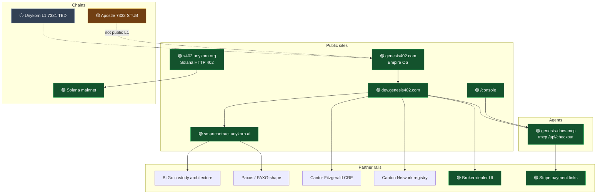
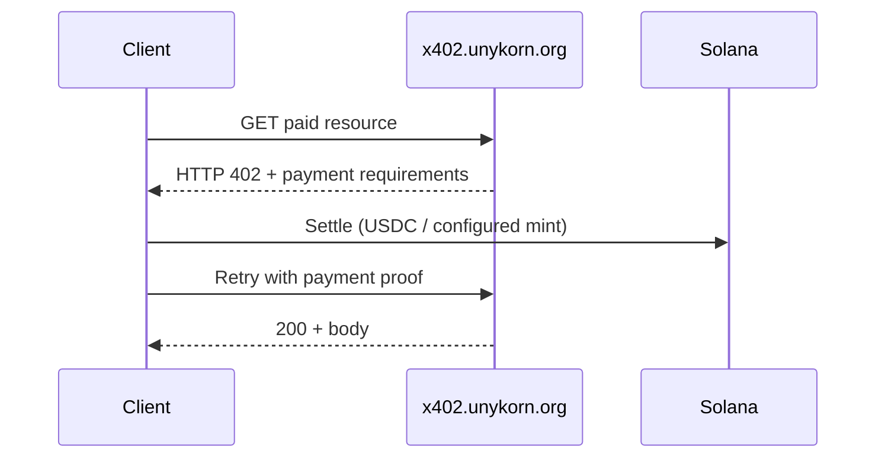
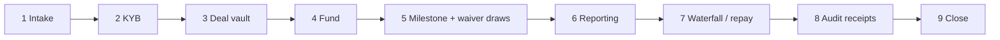
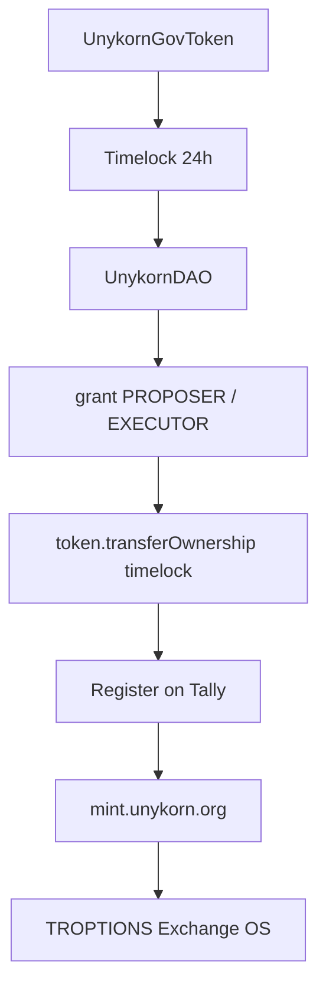

# 402-x

**Genesis402 / Unykorn x402 operator map** — color-coded table of contents, live surfaces, and architecture flowcharts for the FTHTrading stack.

[](#color-coded-table-of-contents)
[](#color-coded-table-of-contents)
[](#color-coded-table-of-contents)
[](#color-coded-table-of-contents)
[](#commerce)
[](https://dev.genesis402.com/)

UnyKorn LLC · Wyoming · public operator documentation. This repo does **not** hold custody keys, BitGo console IDs, or Stripe secrets.

Honesty first: public **x402** is the Solana Worker rail. Apostle **7332** is a local stub. Unykorn L1 **7331** public RPC is not restored. DAO addresses are TBD. RWA contracts are unaudited.

---

## Color-coded table of contents

| | Status | Section | Live URL | Notes |
| --- | --- | --- | --- | --- |
| 🟢 | LIVE | [Empire homepage](#live-surfaces) | [genesis402.com](https://genesis402.com/) | Former `/legacy` page is now the apex |
| 🟢 | LIVE | Operator console | [genesis402.com/console](https://genesis402.com/console) | AgentMail · vault MCP · x402 actions |
| 🟢 | LIVE | Operator docs | [dev.genesis402.com](https://dev.genesis402.com/) | Pages project `dev-portal-unykorn` |
| 🟢 | LIVE | RWA library | [smartcontract.unykorn.ai](https://smartcontract.unykorn.ai/) | GitHub Pages from [smart-contract-builder](https://github.com/FTHTrading/smart-contract-builder) |
| 🟢 | LIVE | MCP worker | [genesis-docs-mcp](https://genesis-docs-mcp.kevanbtc.workers.dev/health) | JSON-RPC `/mcp` + `/api/checkout` |
| 🟢 | LIVE | x402 rail | [x402.unykorn.org](https://x402.unykorn.org/) | Solana HTTP 402 — not Apostle |
| 🟢 | LIVE | Broker-dealer UI | [brokerdealer.unykorn.org](https://brokerdealer.unykorn.org/) | Also [broker.unykorn.ai](https://broker.unykorn.ai) |
| 🟢 | LIVE | System mint | [mint.unykorn.org](https://mint.unykorn.org/) | Solana SPL minter |
| 🟢 | LIVE | Stripe catalog | [commerce/stripe](https://dev.genesis402.com/commerce/stripe/) | Card payment links, software/ops only |
| 🟡 | STUB | Apostle chain 7332 | [apostle.unykorn.org](https://apostle.unykorn.org/) | Local Node stub, not public L1 |
| ⚪ | TBD | Unykorn L1 7331 | — | Public RPC not restored |
| ⚪ | TBD | DAO addresses | [docs/05-dao.md](docs/05-dao.md) | Governor 5.6.0 · UNYG · Polygon |
| 🟣 | UNAUDITED | RWA Solidity | [docs/04-rwa.md](docs/04-rwa.md) | solc 0.8.24 · paris · MIT |
| 🔴 | MISSING | Unykorn Studio GitHub | — | Product is local `:3200`; `FTHTrading/unykorn-studio` is 404 |
| 🟠 | GATED | Stripe Checkout Sessions | `/api/checkout` | Payment Links are live; `sk_live` not stored on the worker |

Deep pages: [Honesty](docs/00-honesty.md) · [Architecture](docs/01-architecture.md) · [x402](docs/02-protocol-x402.md) · [Chains](docs/03-chains.md) · [RWA](docs/04-rwa.md) · [DAO](docs/05-dao.md) · [BitGo](docs/06-custody-bitgo.md) · [Paxos](docs/07-paxos.md) · [Cantor vs Canton](docs/08-markets-cantor.md) · [Broker-dealer](docs/09-broker-dealer.md) · [Stripe](docs/10-commerce-stripe.md) · [MCP](docs/11-agents-mcp.md) · [Sources](docs/12-sources.md)

---

## Live surfaces

```text
genesis402.com              🟢 empire OS (was /legacy)
genesis402.com/console      🟢 operator console
genesis402.com/legacy       🟢 same empire page
dev.genesis402.com          🟢 Genesis Docs OS
smartcontract.unykorn.ai    🟢 RWA catalog (GitHub Pages)
x402.unykorn.org            🟢 Solana 402
brokerdealer.unykorn.org    🟢 BD UI
mint.unykorn.org            🟢 SPL mint
genesis-docs-mcp.kevanbtc.workers.dev  🟢 MCP
```

---

## Stack flowchart



---

## x402 pay-per-request

Public rail is **Solana**, not Apostle 7332.



---

## BitGo deal ops (architecture)

OCC-chartered custody shape. This is **not** a live console dump. Studio `sign_external` — BitGo holds keys.



Draws couple to **DrawEscrow** lien-waiver *evidence* (Georgia statutory form remains off-chain operative). See [docs/06-custody-bitgo.md](docs/06-custody-bitgo.md).

---

## DAO deploy order

OpenZeppelin Governor **5.6.0** · UNYG ERC20Votes · Polygon primary · addresses **TBD**.



Remix / Foundry details: [docs/05-dao.md](docs/05-dao.md).

---

## Commerce

Software and ops services. **Not brokerage.** Live card Payment Links on Stripe account blockchainfraud.org.

| SKU | Amount | Pay |
| --- | --- | --- |
| `operator_docs` | $99 | [Pay](https://buy.stripe.com/14AfZi1uN44y6wA9PkfIs00) |
| `deal_playbook` | $249 | [Pay](https://buy.stripe.com/aFafZi4GZ9oSbQU9PkfIs01) |
| `rwa_family_setup` | $1,500 | [Pay](https://buy.stripe.com/7sY7sM5L358C6wA5z4fIs02) |
| `dao_concierge` | $750 | [Pay](https://buy.stripe.com/bJe3cw4GZgRkaMQ8LgfIs04) |
| `bitgo_onboarding` | $2,500 | [Pay](https://buy.stripe.com/aFa5kE5L38kO8EI0eKfIs03) |

```bash
curl -sS -X POST https://genesis-docs-mcp.kevanbtc.workers.dev/api/checkout \
  -H 'Content-Type: application/json' \
  -d '{"sku":"operator_docs"}'
```

---

## MCP

```json
{
  "mcpServers": {
    "genesis-docs-os": {
      "url": "https://genesis-docs-mcp.kevanbtc.workers.dev/mcp"
    }
  }
}
```

Tools: `docs.search` · `stack.map` · `rwa.families` · `dao.checklist` · `custody.playbook` · `funder.match` · `commerce.catalog` · `commerce.checkout` · `agent.setup`

---

## Related repos

| Repo | Role |
| --- | --- |
| [FTHTrading/402-x-](https://github.com/FTHTrading/402-x-) | This operator map |
| [FTHTrading/smart-contract-builder](https://github.com/FTHTrading/smart-contract-builder) | RWA Solidity + GitHub Pages docs |

Do not invent a public `unykorn-studio` repo. Local Studio is the operator console on `:3200`.

---

## Cantor vs Canton

Never conflate:

- **Cantor Fitzgerald CRE** — funder rail, conduit + high-yield senior, relationship/broker packaging ([cantor.com](https://www.cantor.com)).
- **Canton Network** — institutional DLT participant registry in the platform constitution (`CantonParticipantRegistry`).

---

*Operator map compiled 2026-09-02. Status chips are operational honesty flags, not marketing.*
