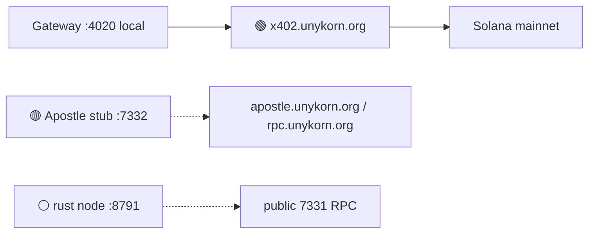

> Part of [402-x](../README.md) · UnyKorn LLC · Wyoming

# Chains 7331 and 7332

| Chain | Role | Public status |
| --- | --- | --- |
| 🟢 Solana | Public x402 HTTP 402 rail | LIVE at [x402.unykorn.org](https://x402.unykorn.org/) |
| 🟡 Apostle 7332 | Dedicated x402/ATP mesh (intended) | STUB — local Node stub, not a public L1 |
| ⚪ Unykorn L1 7331 | Financial IPC / rust node | TBD — local `:8791` has existed; public RPC not restored |

Do not label Apostle 7332 as production LIVE. Do not treat hail.unykorn.org as 7331 RPC (that host is a different product).

Polygon is the **DAO** home (Governor 5.6.0), not chain 7331/7332.
